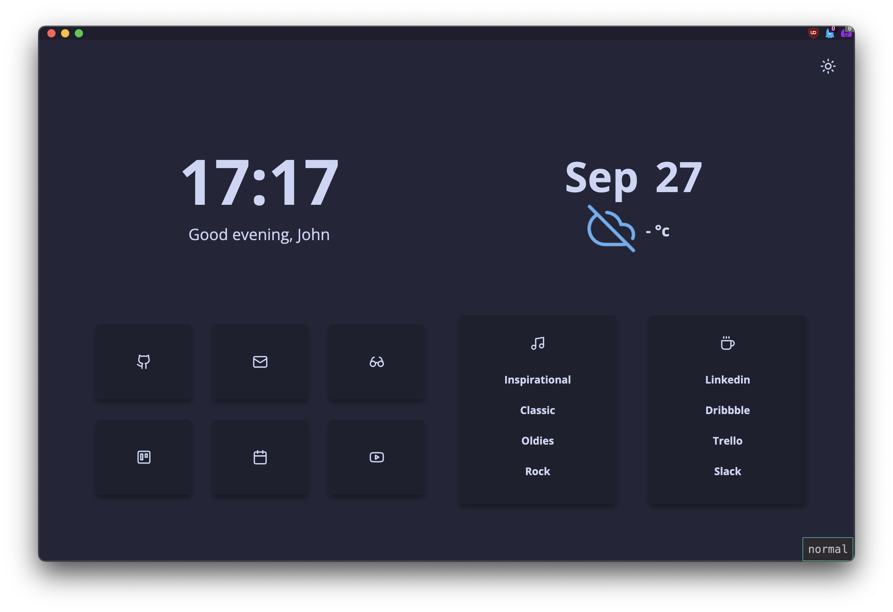
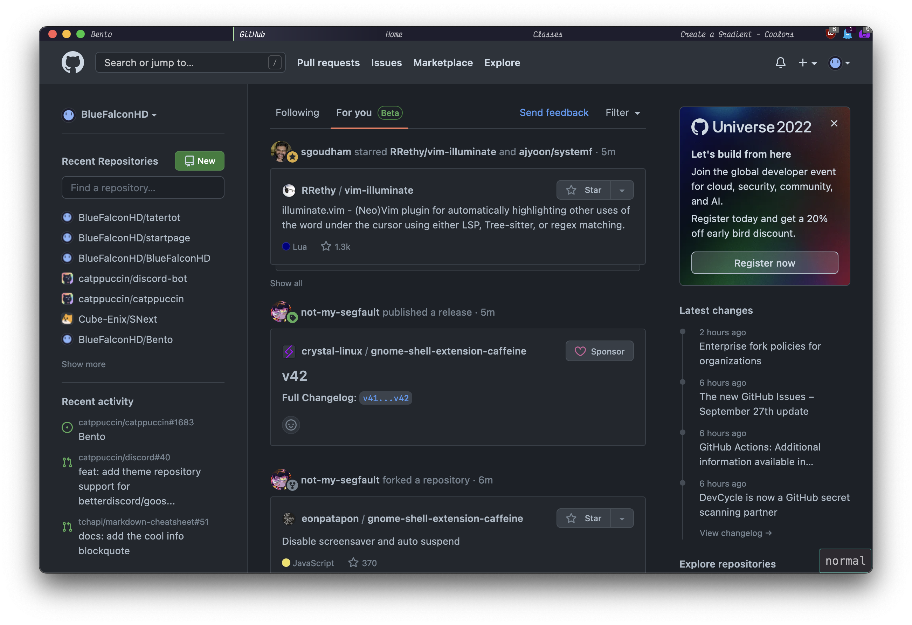

<!-- Firetemple-->

<!-- Top section -->
<p align="center">
  
  <br>
  <h1 align="center" >Firetemple</h1>
  <h3 align="center" >Vim-like minimal Firefox setup.</h3>
</p>

<br>

<!-- Table of contents -->
# 🧂 Table of Contents
- [🧂 Table of Contents](#-table-of-contents)
- [📡 Installing](#-installing)
  - [🤖 Automatic](#-automatic)
  - [✍️ Manual](#️-manual)
  - [🛵 Extras](#-extras)
    - [🧩 Extensions](#-extensions)
    - [⌨️ Fonts](#️-fonts)
- [🌅 Screenshots](#-screenshots)
- [🚀 Contributing](#-contributing)

<!-- Main Usage -->
# 📡 Installing

To install, clone this repository with `git clone https://github.com/bluefalconhd/firetemple`, then [find your Firefox profile path](./profiles.md), and copy it to your clipboard (if you haven't already done so).
## 🤖 Automatic
> **Note**: Automatic installation supports only *nix based systems for now. Also I recommend manual because it is better to install firetemple manually if for some reason I made the install script malicious.
> 
To run the automatic installation, `cd` into the cloned repoitory's location and run `chmod +x install.sh` to make the install script executable. Then run `./install.sh` to run the install script. This will prompt you to paste the previously copied profile path. Then this will copy the necessary files to this location and add a couple settings to your `user.js`.

## ✍️ Manual
1. Copy every file in this repository's `profile` directory to your Firefox profile directory. Ex. `cp ./profile/*  "/Users/hayesdombroski/Library/Application Support/Firefox/Profiles/8nk3882c.default-release/"`
2. Append the following to the file `user.js` in Firefox's profile directory.
```js
// FIRETEMPLE CONFIG //
user_pref("toolkit.legacyUserProfileCustomizations.stylesheets", true); // enables userchrome
user_pref("firetemple.info.enabled", true); // does nothing currently, but may in the future
user_pref("svg.context-properties.content.enabled", true); // enables SVG context properties
```
Example bash script to do this automagically:
```bash
# Set up preference string
$PREFSTRING='// FIRETEMPLE CONFIG //
user_pref("toolkit.legacyUserProfileCustomizations.stylesheets", true); // enables userchrome
user_pref("firetemple.info.enabled", true); // does nothing currently, but may in the future
user_pref("svg.context-properties.content.enabled", true); // enables SVG context properties'

# vvv CHANGE ME TO PROFILE PATH ENDING WITH A SLASH vvv #
$FFOXPROFILE="/path/to/firefox/profile/"
# ^^^^^^^^^^^^^^^^^^^^^^^^^^^^^^^^^^^^^^^^^^^^^^^^^^^^^ #

if [[! -f "${FFOXPROFILE}user.js" ]]; then
    touch "${FFOXPROFILE}user.js"
fi

echo "$PREFSTRING" >> "${FFOXPROFILE}user.js"
```

## 🛵 Extras
### 🧩 Extensions
<details>
    <summary>Click to show extension list.</summary>
    
  | Name                                                                                                                                                            | Tags                                                                      |
  |-----------------------------------------------------------------------------------------------------------------------------------------------------------------|---------------------------------------------------------------------------|
  |[Anti-Adblock Blocker](https://addons.mozilla.org//firefox/addon/%7B7616a0b7-d0b6-4a0d-ad65-c9b35d96bad4%7D)                                                     |  🦊                                                                        |
  |[notion-enhancer](https://addons.mozilla.org//firefox/addon/%7B9b7fdccc-1ec0-478b-bfce-08a8820a5df6%7D)                                                          | [✨](https://github.com/notion-enhancer)                                   |
  |[Custom New Tab Page](https://addons.mozilla.org//firefox/addon/custom-new-tab-page%40mint.as)                                                                   | [✨](https://github.com/MethodGrab/firefox-custom-new-tab-page)            |
  |[Grammar & Spell Checker — LanguageTool](https://addons.mozilla.org//firefox/addon/languagetool-webextension%40languagetool.org)                                 |  🏅 Local-run server is open sourced.                                      |
  |[Tridactyl](https://addons.mozilla.org//firefox/addon/tridactyl.vim%40cmcaine.co.uk)                                                                             | [✨](https://github.com/tridactyl/tridactyl) 🏅                             |
  |[DuckDuckGo Privacy Essentials](https://addons.mozilla.org//firefox/addon/jid1-ZAdIEUB7XOzOJw%40jetpack)                                                         | [✨](https://github.com/duckduckgo/duckduckgo-privacy-extension) 🛑         |
  |[AdNauseam](https://addons.mozilla.org//firefox/addon/adnauseam%40rednoise.org)                                                                                  | [✨](https://github.com/dhowe/AdNauseam) 🛑                                 |
  |[Tampermonkey](https://addons.mozilla.org//firefox/addon/firefox%40tampermonkey.net)                                                                             | [✨](https://github.com/Tampermonkey/) 🏅 V2.9 AND UP ARE NOT OPEN SOURCED  |
  |[uBlock Origin](https://addons.mozilla.org//firefox/addon/uBlock0%40raymondhill.net)                                                                             | [✨](https://github.com/gorhill/uBlock) 🏅 🛑                                |
  |[ClearURLs](https://addons.mozilla.org//firefox/addon/%7B74145f27-f039-47ce-a470-a662b129930a%7D)                                                                | [✨](https://gitlab.com/KevinRoebert/ClearUrls) 🏅                          |
  |[Ghostery – Privacy Ad Blocker](https://addons.mozilla.org//firefox/addon/firefox%40ghostery.com)                                                                | [✨](https://github.com/ghostery) 🏅 🛑                                      |
  > ✨ Open source, 🏅 Must have, 🦊 Firefox port of open sourced extension, 🛑 Adblock/Privacy

</details>

### ⌨️ Fonts
- Victor Mono
- Inter

# 🌅 Screenshots

> Bento new tab page


> GitHub


# 🚀 Contributing
Please use conventional commits when contributing! Thats all!


<!-- Footer  -->
<p align="center" ></p>

<p align="center">
  <span>
    👼
    <a href="https://github.com/bluefalconhd">@bluefalconhd</a>
  </span>
  ⁄
  <span>
    <a href="https://github.com/bluefalconhd/firetemple">firetemple</a>
  </span>
  •
  <span>👮 MIT License</span>
  •
  <span><a href="#-table-of-contents">Jump to Top</a></span>
</p>
